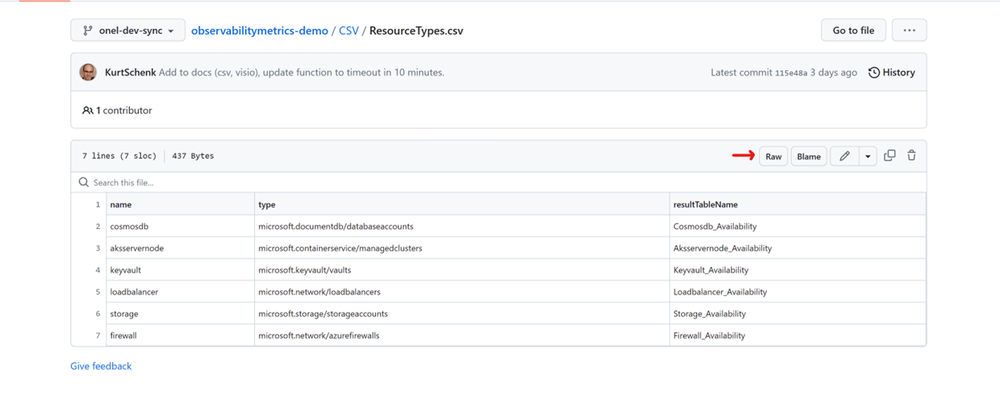

# Solution Approach to Observability

This repository contains reference architecture, code sample and dashboard template for tracking Azure resources availablity (uptime/downtime) trends.

## Architecture

The following diagram gives a high-level view of Observability solution. [Raw Visio File](Images/architecture-raw.vsdx)


1. Timer fires and gets a list of subscriptions and resource types 
2. For each subscription, and resource type, get a list of resource ids
3. And create batches of size N from this list
4. Send each batch of resource ids as a message to Service Bus
5. Function executes for each SB message 
6. And calls Azure Monitor with the batch of resource ids and timeframe to get metrics 
7. And saves metrics json returned in an Azure Blob file
8. And ingests json with the metrics for that resource type into ADX table
9. Dashboard in Grafana

Unlike Azure Monitor which provides the average availability of one resource at a time, this solution provides the average availability of all resources of the same resource type in your subscriptions. For example, instead of providing the availability of one Key Vault, this solution will provide the average availability of all Key Vaults in your subscriptions.


 

## Availability Metrics

Azure Monitor Metrics is a feature of Azure Monitor that collects numeric data from monitored resources into a time-series database. The solution code extract the aggregated metric data from the time-series database and ingest into ADX for dashboarding.

| ResourceType  	| MetricsDetails(AzureMonitor)                                                                                                                 	|
|---------------	|----------------------------------------------------------------------------------------------------------------------------------------------	|
| AksServerNode 	| [kube_node_status_condition](https://learn.microsoft.com/en-us/azure/azure-monitor/essentials/metrics-supported#microsoftcontainerservicemanagedclusters)   	|
| LoadBalancer  	| [VipAvailability](https://learn.microsoft.com/en-us/azure/azure-monitor/essentials/metrics-supported#microsoftnetworkloadbalancers)           	|
| Firewall      	| [FirewallHealth](https://learn.microsoft.com/en-us/azure/azure-monitor/essentials/metrics-supported#microsoftnetworkazurefirewalls)           	|
| Storage       	| [Availability](https://learn.microsoft.com/en-us/azure/azure-monitor/essentials/metrics-supported#microsoftclassicstoragestorageaccounts)     	|
| Cosmosdb      	| [ServiceAvailability](https://learn.microsoft.com/en-us/azure/azure-monitor/essentials/metrics-supported#microsoftdocumentdbdatabaseaccounts) 	|
| Keyvault      	| [Availability](https://learn.microsoft.com/en-us/azure/azure-monitor/essentials/metrics-supported#microsoftkeyvaultvaults)                    	|

## Visualization
This section demonstrates how the main Grafana dashboard visualizes the availability metrics over a timespan for each resource type that is being queried. 


## Getting Started


### Prerequisites
Azure Role Permissions: User should have access to create ManagedIdentity/Service Principal on the subscriptionId

#### Environment:
The script can be executed in a Linux - Ubuntu 20.04/ Azure cloud shell.

#### Install pre-requisite libraries

```sudo apt-get update -y
sudo apt-get install -y git
wget https://packages.microsoft.com/config/ubuntu/20.04/packages-microsoft-prod.deb -O packages-microsoft-prod.deb
sudo dpkg -i packages-microsoft-prod.deb
rm packages-microsoft-prod.deb
sudo apt-get update -y
sudo apt-get install -y dotnet-sdk-6.0
sudo apt-get install -y zip
sudo apt-get install -y jq

## Install az cli
# 1.Get packages needed for the install process:
sudo apt-get update -y
sudo apt-get install -y ca-certificates curl apt-transport-https lsb-release gnupg

# 2.Download and install the Microsoft signing key:
sudo mkdir -p /etc/apt/keyrings
curl -sLS https://packages.microsoft.com/keys/microsoft.asc | \
    gpg --dearmor | \
    sudo tee /etc/apt/keyrings/microsoft.gpg > /dev/null
sudo chmod go+r /etc/apt/keyrings/microsoft.gpg

# 3.Add the Azure CLI software repository:
AZ_REPO=$(lsb_release -cs)
echo "deb [arch=`dpkg --print-architecture` signed-by=/etc/apt/keyrings/microsoft.gpg] https://packages.microsoft.com/repos/azure-cli/ $AZ_REPO main" | \
    sudo tee /etc/apt/sources.list.d/azure-cli.list

# 4.Update repository information and install the azure-cli package:
sudo apt-get update -y
sudo apt-get install -y azure-cli
```

### Installation
```
## Clone git repo into the folder
## TODO: Update github repo link variable

repolink=""
codePath=$"./observability"
git clone $repolink $codePath

## Please setup the following required parameters for the script to run:
## prefix - prefix string to identify the resources created with this deployment. eg: test
## subscriptionId - subscriptionId where the solution will be deployed to
## location - location where the azure resources will be created. eg: eastus
## currentDir - setup full current directory path to where code is cloned

# change directory to where the repo is cloned
cd $codePath

# set variables
prefix=""
subscriptionId=""
location=""
currentDir=$(pwd)

# change directory to where scripts are located
cd $currentDir/Utils/scripts

# command to run
/bin/bash ./deploy.sh $prefix $subscriptionId $location $currentDir

eg: /bin/bash ./deploy.sh "test" "subscriptionIdguid" "eastus2" "/full/path/to/code"
```

### Post Installation
#### Post Installation Steps:
1. Update resource providers to be monitored to the Resource_Providers table
   - load the file - [ResourceTypes.csv](Utils/scripts/csv_import/ResourceTypes.csv)


 > Note: While saving to local ensure that you save the file as a .csv, the default is set to .txt

    - Data ingestion
    - [Click here](DATAINGESTION.md) for details

2. Update subscriptions to be monitored to the Subscriptions table
   - Download the file - [subscriptions.csv](Utils/scripts/csv_import/subscriptions.csv) to local
   - Modify the csv to include details of the subscriptions whose resource health needs to be tracked.
   - Follow the data ingestion steps as detailed for ResourceType.csv above.

3. Add reader role for the managedIdentity created by script to the subscriptions to monitored

#### Grafana access
To add other users to view/edit the Grafana dashboard, follow [adding role assignment to managed grafana](https://learn.microsoft.com/en-us/azure/managed-grafana/how-to-share-grafana-workspace?tabs=azure-portal)
#### Storage access 
sas token - expires in a year need to update it
